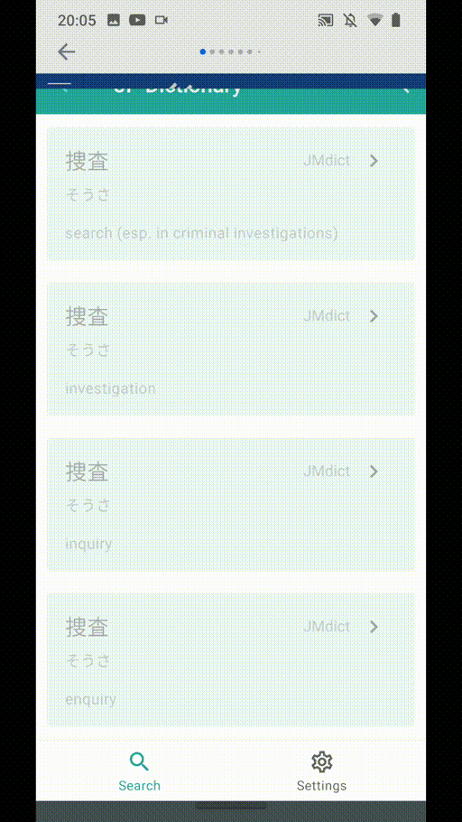

# JP Dictionary

This is a japanese dictionary that supports multiple famous japanese dictionaries such as the JMDict. This app is also easily accessible from almost any other app in your device.

## Demo

Here's how JP Dictionary works like:

You can also lookup words _inside_ definitions:

And the settings page looks like this:

