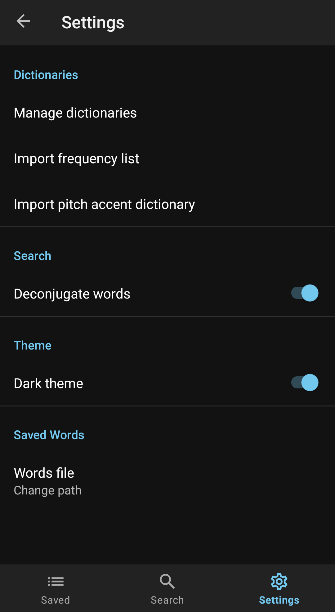

# JP Dictionary

This is a japanese dictionary that supports multiple famous japanese dictionaries such as the JMDict. This app is also easily accessible from almost any other app in your device.

## Demo

Here's how JP Dictionary works like:

You can also lookup words _inside_ definitions:

And the settings page looks like this:

## Installation

You can download the apk from [here](https://mega.nz/file/ad4CwaIJ#etKlTPZqJzqMshc-F2TExjBQBsQXUz2MiacsM1WYat8)

## Feature Ideas

Here are some feature ideas I may plan on adding:

1. Show tags for a word (like frequency)
2. Display pitch accent information as well
3. Example sentences
