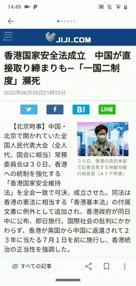

# JP Dictionary
This is a japanese dictionary that supports multiple famous japanese dictionaries such as the JMDict. This app is also easily accessible from almost any other app in your device. 

## Demo

## Installation
1. First download the apk from [here]()
2. Plugin your phone to your computer, and move the [dictionary database](http://www.mediafire.com/file/o5ugdfkjt5njfxo/dict.db/file) to your android's `/data/data/com.example.dictionaryapp/databases/` folder.
   

   