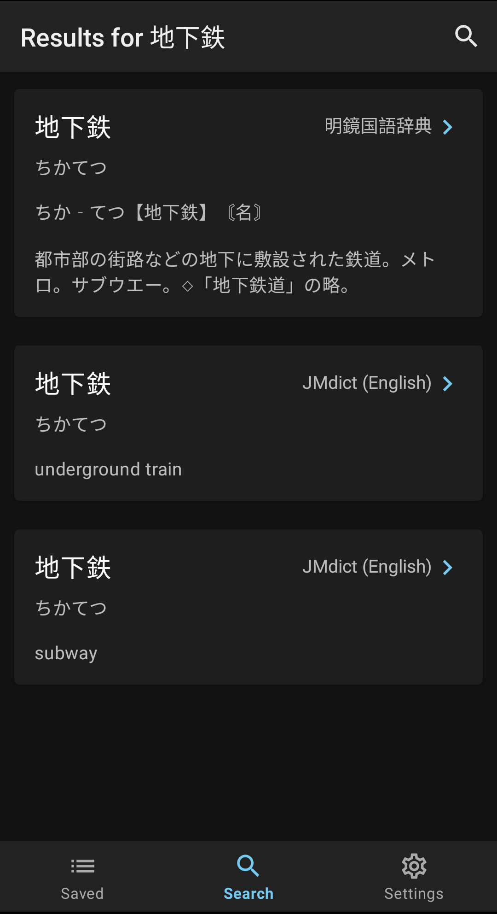
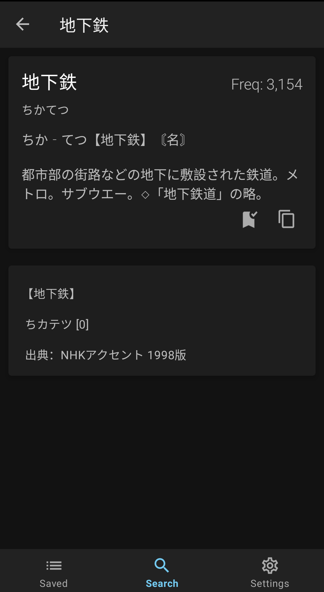
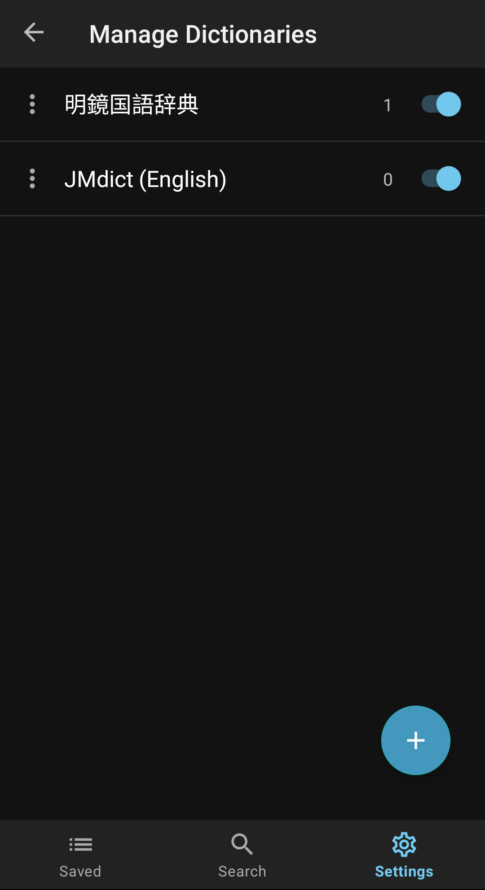
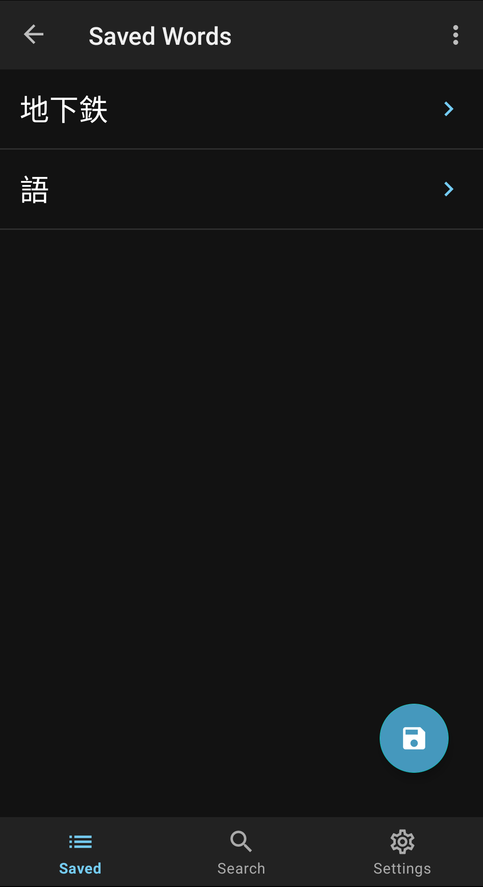
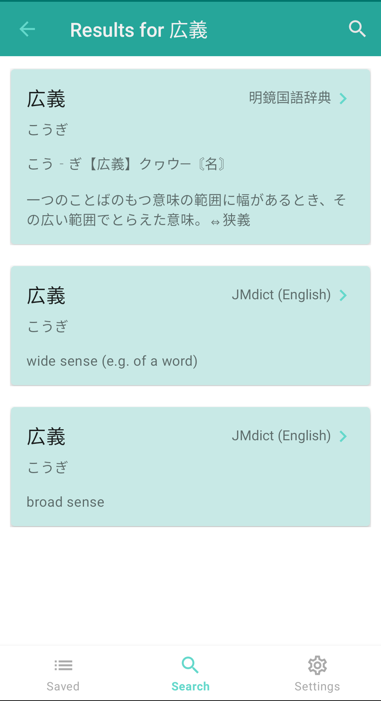

# Rin

Rin is a minimal and lightning fast Japanese popup dictionary app for Android, inspired from Apple's highlight and lookup [feature](https://www.macrumors.com/how-to/look-up-word-definitions-ios-11/).
The installable APK can be found in the latest [releases](https://github.com/kamui-fin/rin/releases/latest).

Features include:

- Blazing fast lookup times
- Light/Dark mode
- Automatic word de-inflection
- Recursive lookups within definitions
- Importing Yomichan dictionaries
  - Frequency and pitch accent dictionaries supported
  - Set dictionary priorities for search result ordering
- Save words into a list
- View word tags

## Screenshots

## Contributing

Rin is actively looking for new contributors!
Feel free to submit any feature requests, bug fixes, or enhancements through Github.
